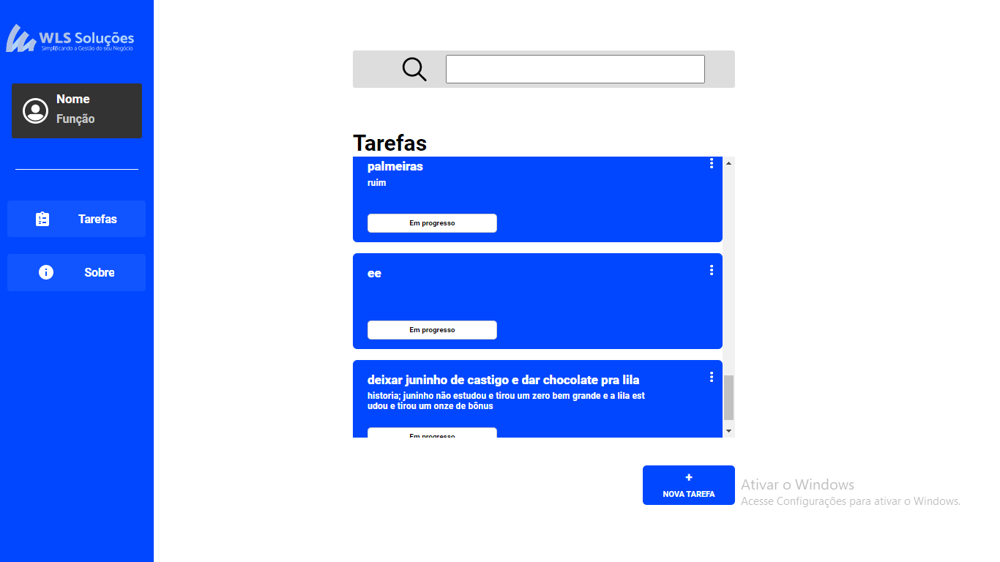

# Visão Geral

Projeto inidivual em React.js para manuseio de tarefas inseridas numa API. Parte do processo seletivo para estágio da WLS Soluções, e da minha prática pessoal.

## Tecnologias

Desenvolvido em Typescript, possui manuseio de estado com redux e ações colaterais com thunks, além de bibliotecas como a Styled Components, que deixa o diretório mais organizado e facilita a modificação dos estilos dos componentes. O programa não conta com todo o potencial de potencial do Typescript pois apresentou mal funcionamento ao se adicionar tipagem forte, mas tal problema deve diminuir nas próximas versões. Se você está lendo isso, fique à vontade para dar um feedback e me ajudar a ser um programador melhor!

## Configuração

Para instalar as dependências necessárias, faça o download dos arquivos e com node no diretório "/tasks-challenge/src/services" execute "npm install" e então "node dist/api.js". Este comando inicia um servidor express na porta 3333 e possui proxy configurado para acesso da API nessa porta. Minha motivação para usar esta configuração de servidor foi a necessidade de enfrentar o protocolo CORS que impedia certas requisições à API. Não obtive sucesso, mas não desisti de tentar e por isso o servidor ainda faz parte do programa. Execute o comando "npm install" no diretório "/tasks-challenge", e por último, npm start para que o servidor React abra na porta 3000.

## Funcionalidades

O programa adiciona novas tarefas associadas a um servidor remoto, mostra as tarefas presentes do servidor e suas características e apaga a tarefa desejada.

## Minhas Dificuldades

Minha maior dificuldade na execução do projeto foi quanto ao manuseamento de estado agregado à tipagem do typescript. O programa não

## Minha Experiência

Foi muito prazerosa pra mim a realização deste projeto. Tive grande contato com tecnologias importantes para o mercado atual de uma área pela qual sou cada dia mais apaixonado, a de desenvolvimento front-end. Ver o redux thunks funcionando me deixou muito feliz e pretendo me aprofundar mu mais no ecossistema do React.js!